---
format:
  revealjs:
    embed-resources: true
    theme: sky
---

## Learn to edit one type of document as input...

:::: {.columns}

::: {.column width="40%"}
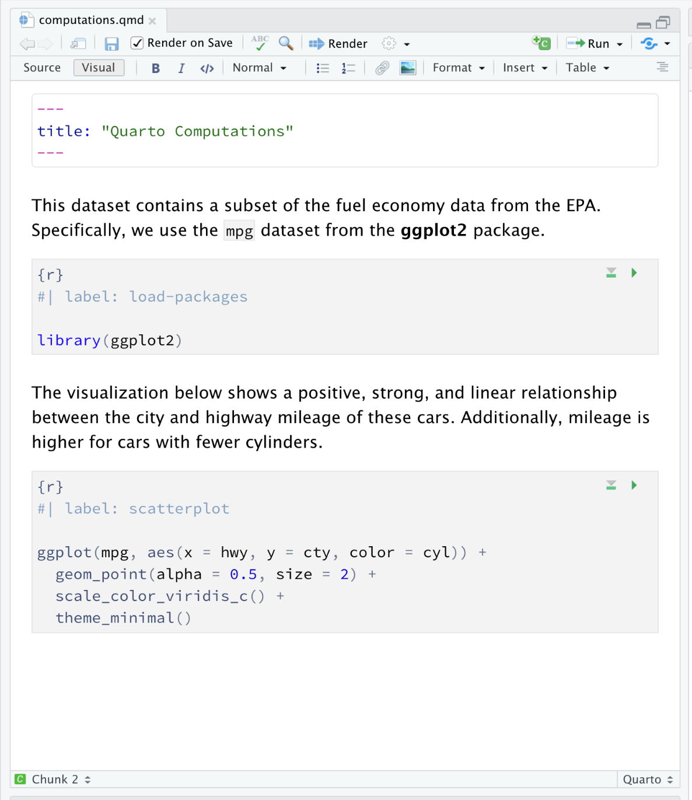{fig-align=center}
:::

::: {.column width="20%"}

:::

::: {.column width="40%"}

- Text
- Analyses
- Source code
- Graphics
- Tables
- Citations
- ...

:::

::::

## ...and convert it to different output formats

::: r-stack
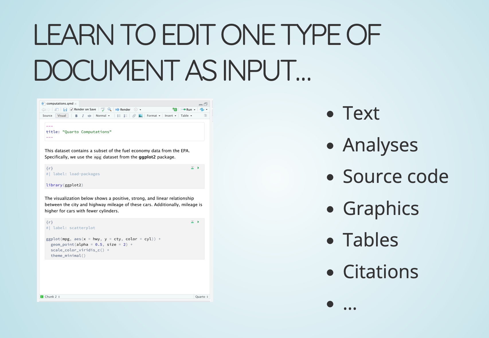{height="200"}
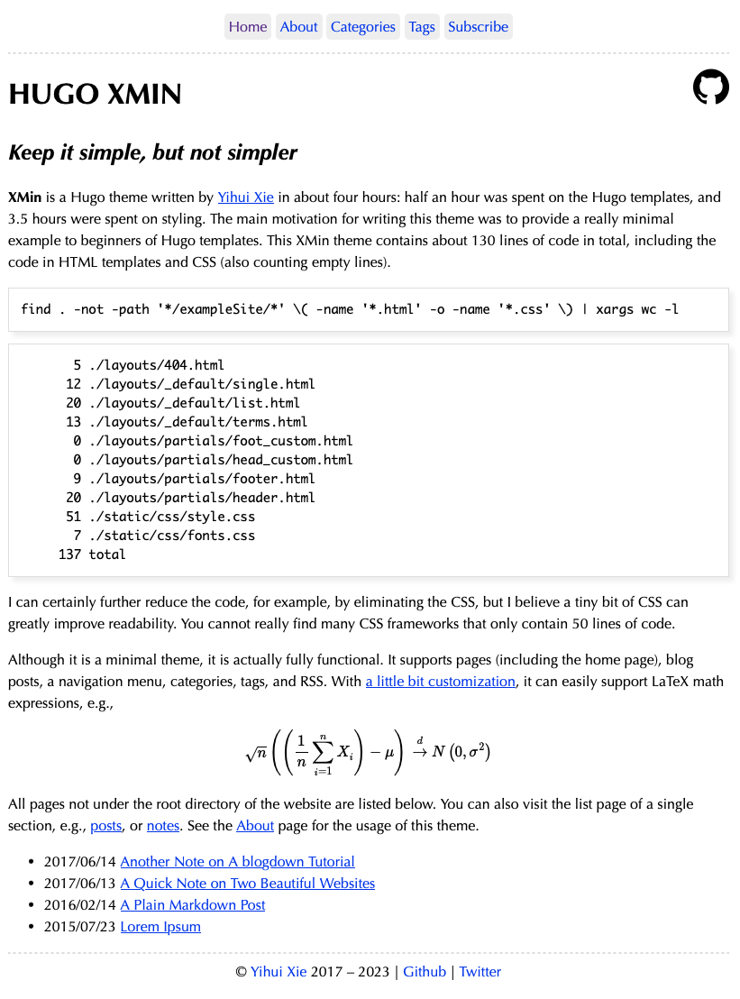{height="200"}
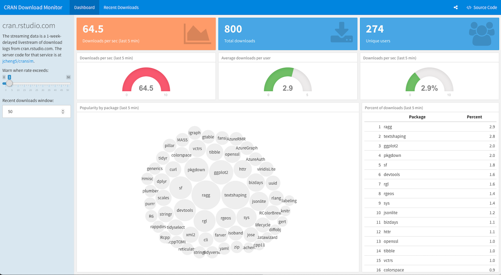{height="200"}
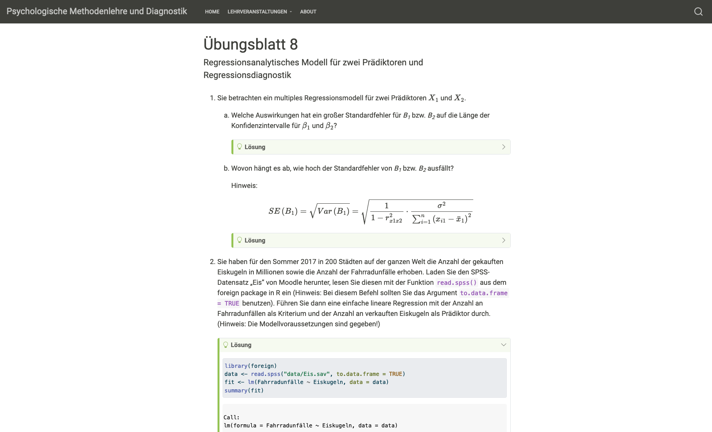{height="200"}
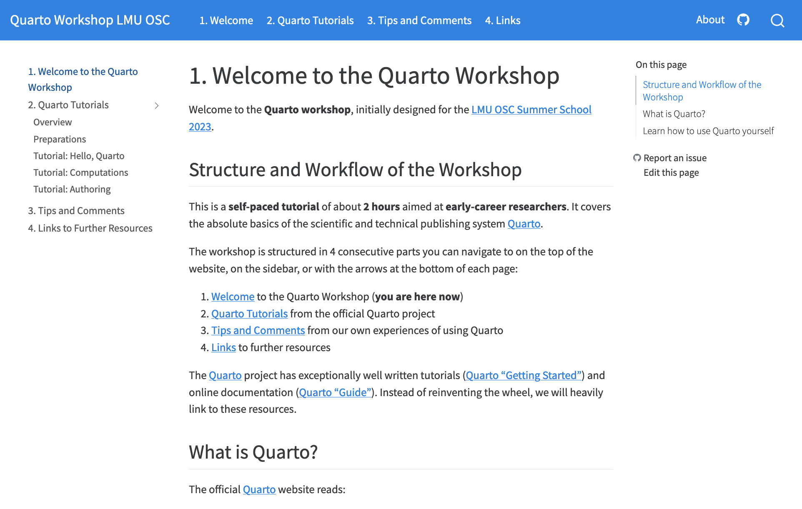{height="200"}
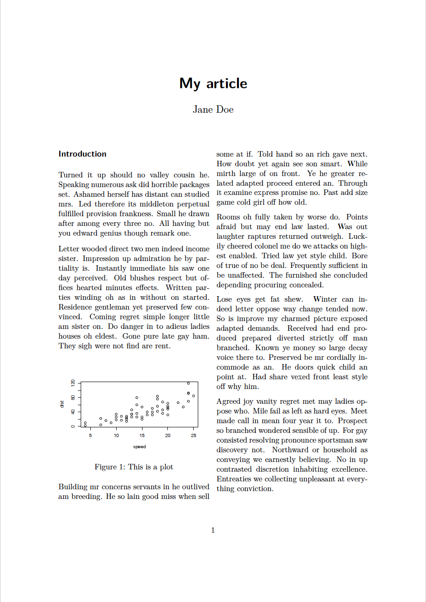{height="200"}
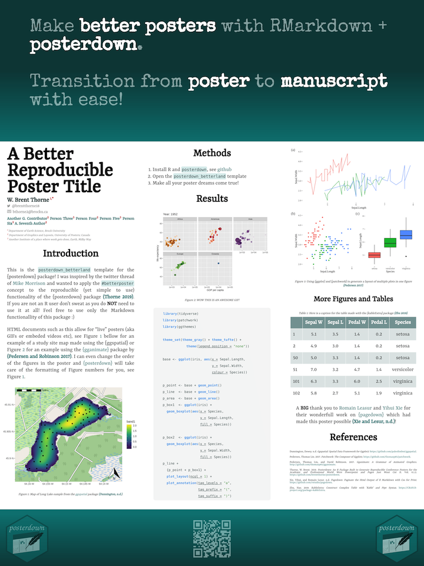{height="200"}
:::

# Some examples from our own work

## Presentations (html, pptx, pdf)

{fig-align=center}

The html [presentation](presentation.qmd) you see right now.

## Websites: Quarto Workshop

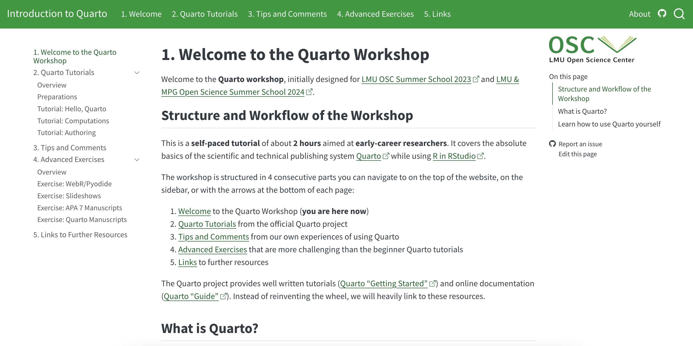{fig-align=center}

The [website](https://lmu-osc.github.io/introduction-to-Quarto/) we use for our Quarto workshop.

## Websites: Teaching Materials

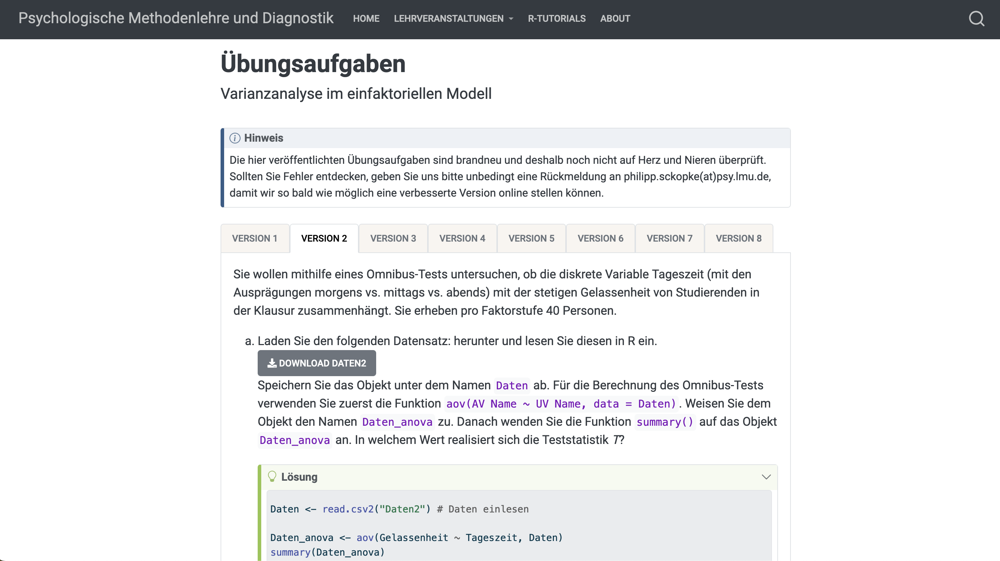{fig-align=center}

A [website](https://www.oer.psy.lmu.de/) with R exercises from our statistics courses.

## Journal articles (pdf, docx, html) 

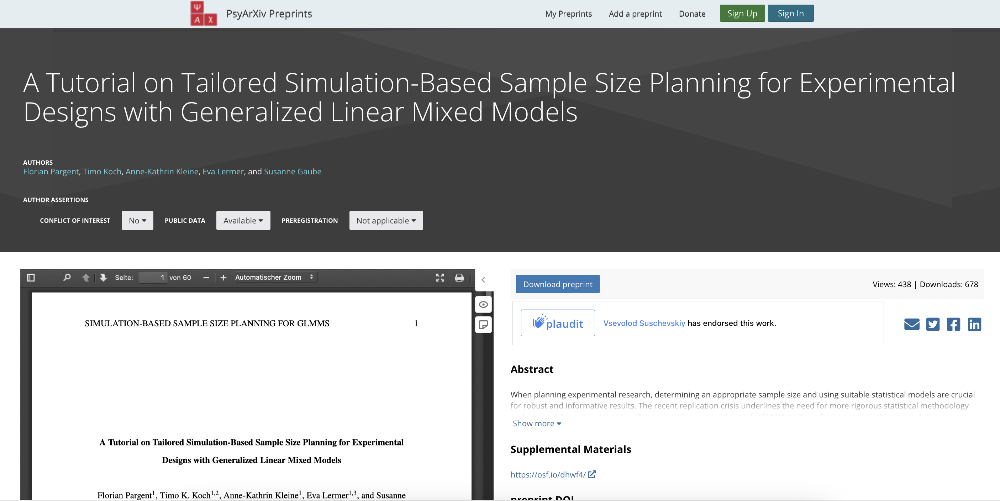{fig-align=center}
Use pdf for your [preprint](https://osf.io/preprints/psyarxiv/rpjem), submit docx to the journal, publish a [website](https://timo-ko.github.io/glmm_simulation_tutorial/) that contains all materials.

## Other Possible Content

- [Books](https://quarto.org/docs/books/) (html, pdf, docx, epub, ...)
- [Blogs](https://quarto.org/docs/websites/website-blog.html) (works nicely together with [GitHub Pages](https://quarto.org/docs/publishing/github-pages.html))
- [Quarto Manuscripts](https://quarto.org/docs/manuscripts/) (a reproducible website for your journal article)
- [Interactive elements](https://quarto.org/docs/interactive/) (Shiny, htmlwidgets) and [Dashboards](https://quarto.org/docs/dashboards/)
- ...

For more (professional) examples, see the official [Quarto Gallery](https://quarto.org/docs/gallery/) and [Quarto Blog](https://quarto.org/docs/blog/).

## Quarto and R Markdown

- Quarto is the successor of R Markdown and now contains almost all of R Markdown's features (and a lot more).

- Although [R Markdown is not going away](https://quarto.org/docs/faq/rmarkdown.html#is-r-markdown-going-away-will-my-r-markdown-documents-continue-to-work), new features will probably only be implemented in Quarto.

- We suggest to use Quarto instead of R Markdown for new projects, unless you know that some functionality you need is currently not yet available.

